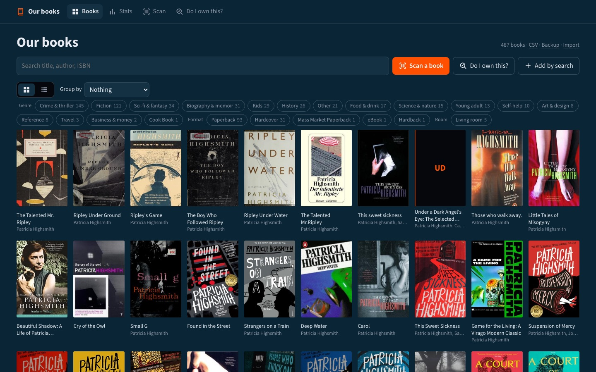
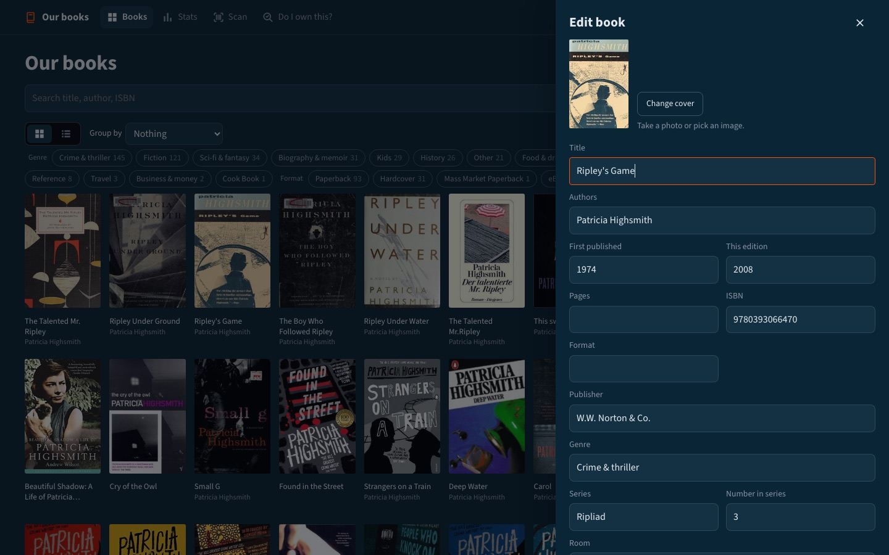
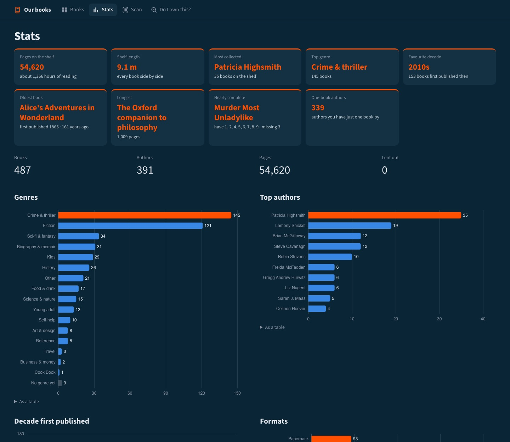
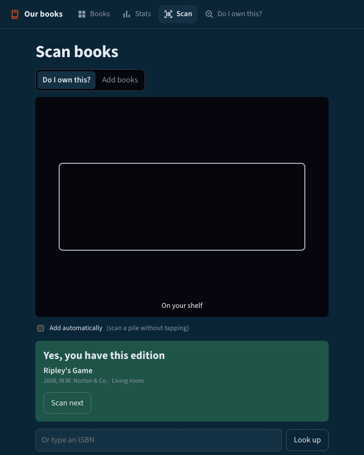
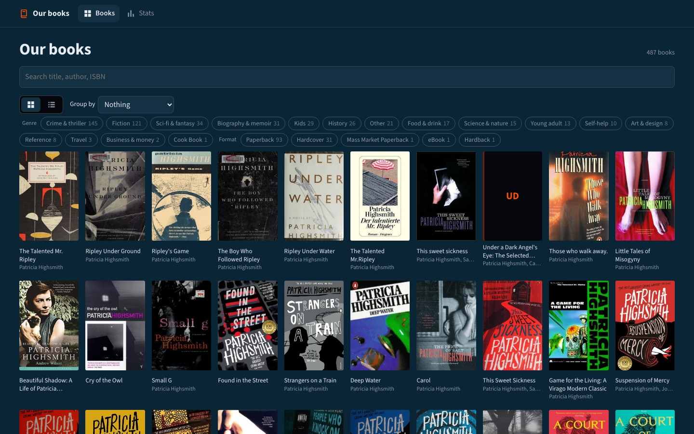
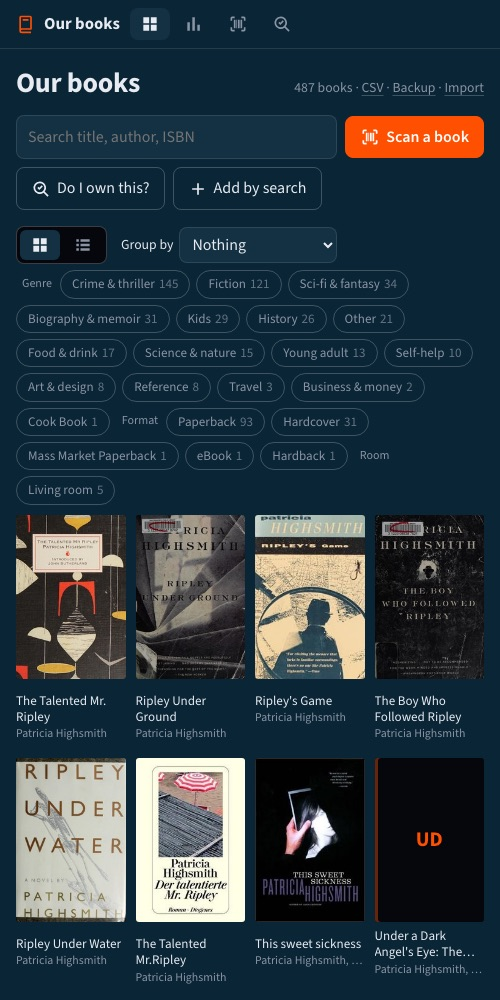

# Ex Libris

**A friendly catalogue for the books you own.** Scan a barcode with your phone and the book is on the shelf: title, author, edition, cover and all. Browse your collection as a wall of covers, see what you've got at a glance, and check in a bookshop whether you already own something.



- **Scan books with your phone's camera.** Book barcodes (ISBNs) straight from the browser; no app to install.
- **"Do I own this?"** Scan in a shop: *yes, this edition* / *you have a different edition* / *no*.
- **Editions, properly.** A paperback and a hardback of the same book are two copies, each with its own cover, year and publisher.
- **Covers found for you** from Open Library and Google Books, or take a photo of your own.
- **Browse** as a cover wall or a list, grouped by author, genre, series (with the gaps: *missing 4, 7*), decade or room.
- **Stats** that are fun to look at: pages, shelf length, most-collected author, favourite decade and more.
- **A read-only public view** you can share, on its own port, that can't change anything.
- **Yours:** one small container, one data folder, CSV import and export, nightly backups. No accounts, no tracking.

| | |
|---|---|
|  |  |
|  |  |

<p align="center"></p>

## Quick start

You need [Docker](https://docs.docker.com/get-docker/).

```bash
mkdir ex-libris && cd ex-libris
curl -O https://raw.githubusercontent.com/ChristopherJohnDillon/ex-libris/main/compose.yaml
docker compose up -d
```

Then open:

| Address | What it is |
|---|---|
| **http://localhost:8080** | **The library:** add, scan, edit, stats, import/export. Keep it private (see [Security](#security)). |
| **http://localhost:8081** | **The public view:** read-only browsing and stats. Safe to share. |

Your books, covers and backups live in `./data` next to `compose.yaml`.

Prefer plain Docker?

```bash
docker run -d --name ex-libris -p 8080:8080 -p 8081:8081 -v "$PWD/data:/data" \
  --restart unless-stopped ghcr.io/christopherjohndillon/ex-libris:latest
```

## Scanning with your phone

Phone browsers only allow the camera on **https** pages (or on `localhost`). On a plain `http://192.168.x.x:8080` address the scanner falls back to typing an ISBN, which always works. For camera scanning, give the library an https address, most easily with one of the options below (both are free).

## Security

**The library app (port 8080) has no login of its own, by design.** Anyone who can reach port 8080 can add, edit and delete books. Put something in front of it:

- **Cloudflare Tunnel + Cloudflare Access (recommended):**
  - The tunnel gives you an https address (so phone scanning works) without opening ports on your router.
  - Access asks for a login (Google, GitHub, or a one-time email code) and lets in only the email addresses you list. Both are free for personal use.
  - [Tunnel guide](https://developers.cloudflare.com/cloudflare-one/connections/connect-networks/) · [Access guide](https://developers.cloudflare.com/cloudflare-one/applications/configure-apps/self-hosted-public-app/)
- **Tailscale:** only your own devices can reach it. `tailscale serve` adds https.
- **Home network only:** don't forward the port. The camera then needs https or `localhost`, as above.

**The public view (port 8081) is safe to share.**
- It is a separate app with no way to change anything: it has no edit, add, delete or import routes at all.
- It shows public details only (title, author, year, format, publisher, ISBN, cover, genre, series, pages), never your notes, rooms or who has borrowed what.
- Its search ignores your notes, and it asks search engines not to index it.
- To share it, point a second hostname at port 8081 (e.g. `books.example.org`) with no login in front. Don't want it? Set `EXLIBRIS_PUBLIC=off`.

## Settings

All optional, as environment variables in `compose.yaml`:

| Variable | Default | What it does |
|---|---|---|
| `EXLIBRIS_TITLE` | `Our books` | The library's name, shown at the top |
| `EXLIBRIS_PUBLIC` | `on` | `off` turns the public view (port 8081) off |
| `EXLIBRIS_OPENLIBRARY_CONTACT` | | Your email, sent to Open Library with lookups; they allow faster lookups for identified apps |
| `EXLIBRIS_GOOGLE_BOOKS` | `on` | `off` stops using Google Books to find missing covers |
| `EXLIBRIS_AI_URL` | | Optional AI, see below |
| `EXLIBRIS_AI_MODEL` / `EXLIBRIS_AI_KEY` | | Model name / API key for the AI server |
| `PUID` / `PGID` | `1000` | The user and group that own the files in `./data` |
| `TZ` | `Etc/UTC` | Time zone (for nightly backups and loan dates) |

## Optional AI

Point `EXLIBRIS_AI_URL` at any OpenAI-compatible server (e.g. [Ollama](https://ollama.com) on another machine, LM Studio, or OpenAI) and Ex Libris will:
- sort your books into genres from their Open Library subjects. It never overwrites a genre you've set yourself.
- add a playful "fun facts" card to the stats page, using only numbers it's given.

It's off unless you set it, and nothing else depends on it.

## Where to run it

Anywhere Docker runs with a disk that keeps its files. It idles at about 50 MB of memory. Images are built for Intel/AMD and ARM (Raspberry Pi, Apple silicon).

- **A computer you already have:** a Raspberry Pi, an old laptop, or a NAS (Synology, Unraid, TrueNAS). Add Cloudflare Tunnel for https and a login. Free.
- **Google Cloud "Always Free" e2-micro:** 1 GB of memory and a 30 GB disk is plenty. US regions only.
- **A small VPS:** Hetzner and similar, a few euros a month.
- **Avoid** free app platforms that don't keep a disk (e.g. Render's free tier). Your library would vanish on restart.

## Backups

- **Every night:** a checked copy of the database and a CSV go into `./data/backups` (30 days kept).
- **On demand:** **Backup** on the library page downloads a zip of everything (database, CSV, covers).
- **To restore:** stop the container, copy a backup `library-YYYYMMDD.db` to `./data/library.db` (delete any `library.db-wal` / `library.db-shm` files next to it), and start it again.
- **Moving from another app?** **Import** takes a CSV. Columns: `title` (required), `authors`, `year`, `isbn`, `format`, `publisher`, `pages`, `genre`, `series`, `series_index`, `location`, `notes`. You see a preview before anything is added.

## Credits

- Book details and covers come from [Open Library](https://openlibrary.org), a project of the Internet Archive, with missing covers from [Google Books](https://books.google.com). Please be kind to their servers; Ex Libris paces and caches its requests.
- Barcode reading: [ZXing](https://github.com/zxing-js/library). Charts: [Apache ECharts](https://echarts.apache.org). Font: [Source Sans 3](https://github.com/adobe-fonts/source-sans). See `exlibris/web/static/vendor/THIRD_PARTY.md`.

## Licence

MIT
